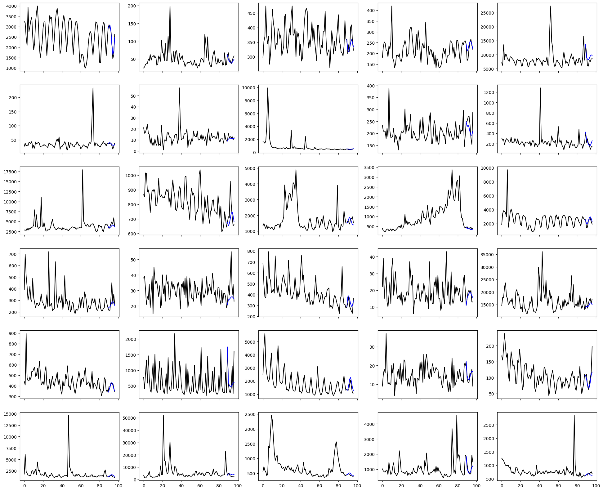

## Summary:

### Goals:
- Build a forecasting model to predict future web traffic for approximately 145,000 Wikipedia pages.
- Investigate the effectiveness of LSTM neural networks in handling multiple time series for this prediction problem.

### Assumptions:
- The model is expected to forecast web traffic for 7 days based on the historical traffic from last 90 days.

### Data and inspiration:
https://www.kaggle.com/competitions/web-traffic-time-series-forecasting/data

### Results:

To address the problem I developed several LSTM-based models. The best-performing model achieved RMSE of 0.0809 on the test dataset (not used for validation).  
Comparatively, the baseline models achieved the following scores:
- Naive model (returns the last seen value): 0.1071
- Random model (random within the expected range): 0.3946

Key observations regarding the model's performance:
- The developed model outperformed both the naive and random models. 
- The model consistently produced predictions within the expected ranges. There were no instances of particularly glaring or counterintuitive errors in predictions.
- It accurately captured seasonality in highly seasonal time series.
- In scenarios where previous values were peeks or outliers, the model successfully returned to typical values.
- The model maintained stability by avoiding unnecessary noise when predicting steady time series.

Some examples:

## Model description

### Features:
- Main feature:
    - Traffic history (number of visits)
- Time-related features:
    - Day of the week
- Page-specific features:
    - Page attributes: project, access, agent
    - Median visits over the whole period
    - Weekly seasonality (autocorrelation)

The following actions were undertaken based on conclusions drawn from data exploration:
- Excluded parts of data recognized as invalid.
- Applied scaling with a logarithmic function and normalization using maximum absolute value to the traffic data.
- Included page median visits as a feature representing the magnitude of traffic for each page.
- Employed additional time features, including day of the week represented by sine and cosine waves with a period of 7, and autocorrelation of page visits lagged with an interval of 7 days.
- Employed additional one-hot-encoded page features, including project, access, and agent.

*For further details refer to data_exploration.ipynb*

### Model architecture:
I experimented with two general model architectures:
1. **Single-input model**: Consists of LSTM layers followed by Dense layers. All static (time-independent) features are extended to each unit of time and processed alongside time series features.
2. **Multi-input model**: Involves LSTM layers that consume only time-dependent features and parallel feed-forward layers processing static features. Both are then concatenated and followed by Dense layers combining results of 

For each architecture type, I explored several variations by adjusting:
- the number of LSTM layers
- the number of Dense layers
- the number of units within each layer

The most effective model was determined after conducting multiple sessions of hyperparameter tuning.

Conclusions:
- Even the simplest single-input models were capable of quite good results within just a few epochs by roughly approximating the future traffic level. It suggests that modelling the general future traffic level is accomplished relatively easily.
- However, despite many trials these models failed to capture seasonality and more complex patterns, often predicting identical values for all consecutive days.
- The multi-input model significantly improved the modeling of seasonality. 
- It also demanded less time and data for training in contrast to the single-input model. This reduction was faciliated by decreasing the extensive parameter load used in the single-input model to handle static features in LSTM layers. 
- In conclusion, feeding static features into feed-forward layers proved more beneficial compared to extending them and incorporating them into LSTM layers.
- Based on experiments, utilizing two stacked LSTM layers (32 and 16 units) for time-dependent features emerged as the optimal configuration, balancing model complexity with the training process efficiency. 
- Static features were fed into a single Dense layer parallel to LSTM part of the model. Then the outputs of both sub-models were concatenated and followed by a few more Dense layers. It allowed to combine insights derived from both time-related and static features.
- Experimentation revealed that while increasing the number of Dense layers marginally slightly improved performance, this enhancement plateaued beyond a certain point. Therefore, additional Dense layers were only added until a significant gain in performance was no longer observed.
- Standard relu activations were utilized for Dense layers, while a sigmoid function was employed in the output layer to predict values within the (0,1) range, representing the normalized logarithm of the traffic data.

The final best-performing model comprised:
- Two parallel sub-models:
    - Two stacked LSTM layers (32 and 16 units) dedicated to time-depended features
    - Dense layer (16 units with relu activation) responsible for handling static features
- Concatenation of the two sub-models
- Two hidden Dense layers (32 and 16 units with relu activation)
- A multi-output Dense layer (7 units with sigmoid activation)

After predictions and evaluation scaling of the traffic data is inversed to obtain final results.

### Loss:
I used Huber loss with an alpha parameter set to 0.25.  
This choice helped the model focus on traffic patterns while disregarding occassional outliers encountered frequently.  
The 0.25 parameter value was determined based on 3 times the median standard deviation of page visits to filter out these outliers.  

*For further details refer to data_exploration.ipynb*

### Samples, epochs and batch size:
The model is continuously supplied with random 90-day samples (followed by a 7-day predicted period) extracted from each page's visit history. Therefore a training epoch differs slightly from the conventional interpretation.
During each epoch, the model trains using n samples extracted from every page, ensuring all pages contribute to each epoch. Subsequent epochs involve new samples from different time periods, maintaining diversity in the training data.

The number of samples per page, along with the batch size, determines whether batches comprise samples from the same or different pages:  
- For instance, if BATCH_SIZE=16 and N_SAMPLES=1, each batch contains 16 inputs from distinct pages.
- Conversely, if BATCH_SIZE=8 and N_SAMPLES=8, all 8 inputs in the batch are from a single page.

I experimented with various batch sizes (from 8 to 128) and numbers of samples (from 1 to 8). Through hyperparameter tuning, n_samples=4 and batch_size=8 were identified as optimal values.  
Reducing the batch size to 8 notably enhanced the model's generalization, albeit at the cost of increased computation time.  
Simultaneously setting the number of samples to 4 enabled the model to capture page-specific patterns by having only two pages per batch with 4 samples each.  

Efforts to equate the batch_size to the number of samples resulted in overfitting issues.

### Regularization:
Several experiments using dropout and L2 regularization techniques were conducted.
- In the development phase, L2 Regularization proved valuable when models struggled to capture seasonality and complex patterns. It effectively guided the model to emphasize diverse features, aiding in learning complex patterns.
- In hyperparameter tuning, recurrent regularization yielded the most favorable outcomes. Kernel regularization hindered the learning process and bias regularization showed minimal impact on model performance.
- Dropout layers and LSTM's recurrent dropout did not outperform L2 regularization while significantly increasing the learning time.
- As the optimized model architecture effectively generalized to unknown data and captured seasonality and intricate patterns, the necessity for regularization diminished. Eventually, the best results were achieved without regularization, which led to its omission in the final model.

### Optimizer and Learning Rate:
I used the standard Adam optimizer with a decaying learning rate strategy. This approach aimed to promptly achieve satisfactory results and subsequently focus on capturing additional patterns.

### Hardware:
Hyperparameter tuning and the final model optimization were performed using A100 GPUs, resulting in a 90% reduction in computation time compared to CPU-based calculations.